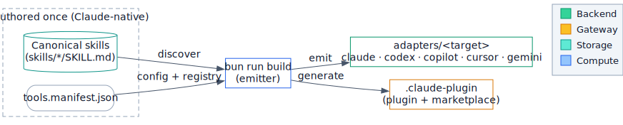

# agent-docs

Agent skills for project documentation: scaffold a Starlight docs site from an
interview, generate portable diagrams, and write house-style docs.

Authored once in Claude-native form and emitted to **Claude, Codex, Copilot, Cursor,
and Gemini** — so the same skills work across every agent you use.

## What's inside

Three skills ship in this plugin:

| Skill                 | What it does                                                                                             | Invoke                             |
| --------------------- | -------------------------------------------------------------------------------------------------------- | ---------------------------------- |
| **doc-site**          | Scaffolds an Astro + Starlight documentation site into a repo from a short interview.                    | `/doc-site [target repo path]`     |
| **diagram-generator** | Turns a prose description into a polished SVG/PNG diagram (architecture, flowchart, sequence, and more). | `/diagram-generator [description]` |
| **docs-helper**       | Reviews and edits documentation to match a project's house style.                                        | `/docs-helper [doc path]`          |

Each skill is self-contained: it carries its own reference docs (and, for
diagram-generator, a bundled renderer) so it runs without network access beyond what
its task explicitly needs.

## Install

agent-docs is a Claude Code plugin.
Add it from this repository — the marketplace entry
(`.claude-plugin/marketplace.json`) points at the repo root (`source: "."`):

1. Clone the repo (or point Claude Code at its URL).
2. Add it as a plugin marketplace source in Claude Code.
3. The three skills become available as `/doc-site`, `/diagram-generator`, and
   `/docs-helper`.

Using a different agent?
The same skills are emitted to four other targets under `adapters/<target>/` —
`claude`, `codex`, `copilot`, `cursor`, and `gemini`.
Point your agent at the bundle for its platform (for example,
`adapters/cursor/rules/` for Cursor).
See [`CONTRIBUTING.md`](CONTRIBUTING.md) for how the bundles are generated.

## The skills

### doc-site — scaffold a documentation site

`doc-site` stands up a canon-faithful **Astro + Starlight** documentation site inside
a target repo.
It drives a short interview, then mechanically emits a set of template assets — it
never hand-writes plumbing, so the output is a pure function of your answers.

It runs as a short, phased workflow:

1. **Detect** — network-free probes for monorepo layout, package manager, runtime,
   existing docs, CI, default branch, and repo slug. Seeds sensible defaults.
2. **Interview** — asks only what it can't infer: site title and description, social
   links, how content is sourced, sidebar mapping, deploy targets, and accent colors.
3. **Emit** — substitutes tokens into byte-identical templates and writes the site.
4. **Set up content** — materializes content symlinks when you choose symlink/mixed
   mode.
5. **Smoke-test** — installs dependencies and runs the build; it never reports success
   on a red build.

Highlights:

- **Content modes** — `native` (author `.mdx` directly), `symlink` (point the docs
  tree at canonical files elsewhere in the repo), or `mixed`.
- **Optional components** — diagrams (wired to diagram-generator), deploy wiring for
  **GitHub Pages / Vercel / Netlify**, a manifest **drift guard**, and **monorepo**
  workspace support. All are opt-in.
- **Safe and additive** — it writes only inside the target repo, refuses symlink
  sources that escape the repo root, never transmits repo data, and never clobbers
  your edits on a re-run (managed files are tracked by checksum).

Deeper reference docs ride alongside the skill under
[`skills/doc-site/references/`](skills/doc-site/references/) — detection, interview
parameters, the `docs.manifest.json` contract, deploy wiring, and the re-run policy.

### diagram-generator — diagrams from prose

`diagram-generator` produces real diagram **images**, not ASCII art.
You describe what you want; the skill authors an engine-neutral `DiagramSpec` and runs
the bundled, network-free renderer CLI.



_The diagram above is generated by the skill from a small `DiagramSpec` — it shows
this repo's own build pipeline._

Six diagram types are supported:
`architecture`, `flowchart`, `sequence`, `er`, `state`, and `dataflow`.
Output is **SVG and/or PNG**, in **light or dark** themes, with an optional accent
color.

A core rule keeps diagrams trustworthy: the skill depicts **only what you described**
— it never invents a database, cache, or gateway you didn't mention.

The same renderer powers both the conversational path (the skill, from your prose) and
a scriptable path (a build step, from a committed `DiagramSpec` file). Both converge on
one CLI contract:

```text
diagram-render <input.json | -> [--type <type>] [--theme light|dark] [--accent #rrggbb]
               [--format svg|png|both] [--out-file <path> | --out-dir <dir> [--out-name <base>]]
```

The authoring reference and craft rules live under
[`skills/diagram-generator/references/`](skills/diagram-generator/references/) —
the full `DiagramSpec` schema, the closed `NodeRole` color vocabulary, and a worked
example per type.

### docs-helper — house-style documentation

`docs-helper` helps you write and review docs against a project's house style — one
sentence per line, sentence-case headings, fenced code blocks with languages, and
links to canonical sources rather than copies.
It suggests concrete edits rather than rewriting wholesale.
The full style guide is at
[`skills/docs-helper/references/style-guide.md`](skills/docs-helper/references/style-guide.md).

## Multi-target support

The skills are authored once in Claude-native form and emitted to five targets, each
in that platform's native shape:

| Target  | Bundle shape                                        |
| ------- | --------------------------------------------------- |
| claude  | `skills/<name>/SKILL.md` (native, no drops)         |
| codex   | `skills/<name>/SKILL.md`                            |
| copilot | `instructions/<name>.instructions.md`               |
| cursor  | `rules/<name>.mdc`                                  |
| gemini  | `skills/<name>/<name>.md` + `gemini-extension.json` |

Per-target feature drops (for example, where a target can't represent
`argument-hint`) are recorded in
[`adapters/GENERATION-REPORT.md`](adapters/GENERATION-REPORT.md).

## Repository layout

```text
skills/                  Canonical skill sources (the single source of truth)
  doc-site/              SKILL.md + references/ (+ templates)
  diagram-generator/     SKILL.md + references/ + bundled renderer
  docs-helper/           SKILL.md + references/style-guide.md
adapters/<target>/       Generated per-target bundles (committed, drift-guarded)
.claude-plugin/          Generated plugin.json + marketplace.json
src/                     The emitter and the diagram runtime
specs/                   PRDs, tech specs, and section specs
docs/architecture/       Per-feature architecture docs
tools.manifest.json      Tool registry + build config
```

## Contributing

Adding or changing a skill, and how the build emits the adapter bundles, is documented
in [`CONTRIBUTING.md`](CONTRIBUTING.md).
In short: edit the canonical source under `skills/`, register it in
`tools.manifest.json`, run `bun run build`, and verify with `bun run gate`.

## Author

Gary Gentry. No license file is currently included in this repository.
