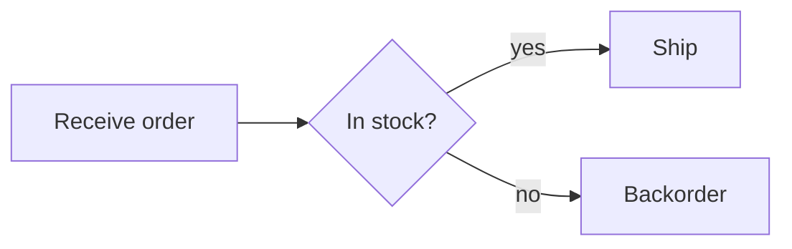

# Mintlify diagrams (agent reference)

Mintlify renders **Mermaid natively** — no vendored renderer, no prebuild step. This is a
deliberate divergence from Starlight's vendored `diagram-render.mjs` + Astro prebuild
(`../diagrams.md`): for Mintlify, prefer native Mermaid.

## Default — native Mermaid

Author diagrams as fenced Mermaid blocks directly in a page:

````mdx

````

When a DocPlan `DocPlanEntry.diagrams[]` prose request drives a diagram, translate it into a
Mermaid block, describing **only** components verified in `sourceRefs` (preserve
`diagram-generator`'s "draw only what you're told" rule). No prebuild, no image files, no
`diagrams` component wiring — Mermaid ships in the page body.

## Optional — styled SVG embed

If the user wants the house visual language (the `diagram-generator` SVG style) instead of raw
Mermaid, render an SVG via the sibling `diagram-generator`
(`../../diagram-generator/scripts/diagram-render.mjs`) and embed it as an image with descriptive
alt text:

```mdx

```

Store the SVG under `{{DOCS_PKG_DIR}}/images/` (Mintlify serves it root-relative). This is opt-in;
native Mermaid is the zero-build default.

## Component-selection note

The Starlight `diagrams` component (vendored renderer + `prebuild`) is **not** emitted under
`renderer=mintlify`. If the user asked for diagrams, use the Mermaid default above; only vendor
the renderer when they explicitly want SVG embeds.
