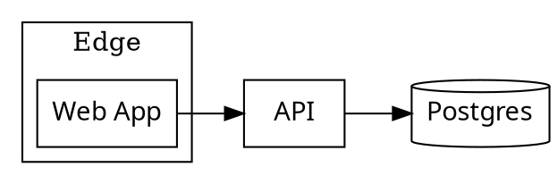

# 03 — Rendering Engine

The render pipeline that turns a validated `DiagramSpec` into tier-2-portable SVG.
This document specifies the four `src/diagram/` modules that constitute the
rendering core (see `01-architecture-layout.md` §1 for placement, §3 for the import
graph):

- `src/diagram/dot-emit.ts` — `DiagramSpec` → Graphviz DOT for the five
  graph-shaped diagram types (§2).
- `src/diagram/graph-render.ts` — DOT → raw SVG via `@viz-js/viz` (Graphviz-WASM)
  (§3).
- `src/diagram/sequence-svg.ts` — direct-SVG layout for `sequence` diagrams (§4).
- `src/diagram/render.ts` — orchestration: validate → branch on type → theme +
  post-process → assert → `RenderResult` (§5).

All shared types (`DiagramSpec`, `Node`, `Edge`, `Container`, `Participant`,
`Message`, `NodeRole`, `Theme`, `RenderResult`) and error classes
(`DiagramRenderError`, `DiagramOutputError`) come from `00-core-definitions.md` —
this document **references** them and never redefines them. Color, font embedding,
a11y injection, and the determinism-canonicalization pass are **not** done here;
they live in `svg-postprocess.ts` (`04-theme-postprocess-png.md`), which `render.ts`
calls. PNG rasterization (`png.ts`, `04`) is invoked by the CLI, not by this
pipeline (§5).

## Requirement Coverage

| REQ ID       | Requirement                                                                        | Section                 |
| ------------ | ---------------------------------------------------------------------------------- | ----------------------- |
| REQ-COV-01   | Architecture / box-arrow-flow diagrams (nodes, edges, containers, role color hook) | 2.2, 2.3, 2.4           |
| REQ-COV-02   | flowchart / sequence / ER / state / data-flow types                                | 2.2, 4                  |
| REQ-OUT-01   | Tier-2 SVG: plain `<text>`, no HTML-like labels / `<foreignObject>`                | 2.1, 2.5, 3.2, 4.5, 5.3 |
| REQ-OUT-02   | Explicit `viewBox` + width/height, well-formed coordinates                         | 4.2, 4.6, 5.3           |
| REQ-REL-01   | Validate well-formed before emit (output assertion call)                           | 5.2                     |
| REQ-REL-02   | Fail loudly — wrap engine errors in typed errors                                   | 3.3, 4.7, 5.4           |
| REQ-REPRO-01 | Determinism (no engine-side IDs/randomness; canon pass cross-ref)                  | 2.6, 3.4, 5.5           |

OTQ-3 (sequence layout details — lifeline spacing, activation bars, self-messages,
overlap) is resolved in §4.

## 1. Position in the pipeline

```
DiagramSpec ──parseSpec(02, at CLI)──► render(spec,opts)              (§5)
                                  │
              diagramType==="sequence" ? ──► renderSequence(spec)     (§4)
                                  │                  │  {svg,width,height}
              else ──► emitDot(spec) ─► renderGraph(dot)              (§2,§3)
                                  │                  │  raw SVG
                                  ▼                  ▼
                       postProcess(svg, {theme,accent,spec})  (04 §3)
                                  │   ← color by NodeRole, embed font,
                                  │     inject <title>/<desc>/role, canonicalize
                                  ▼
                       assertOutputValid(svg)            (02 §3, REQ-OUT/A11Y)
                                  ▼
                       RenderResult                      (00 §3.2)
```

The graph path (`emitDot` → `renderGraph`) and the sequence path (`renderSequence`)
**converge** on the same plain-`<text>` SVG shape, so a single post-process +
single output-assertion stage serves both (tech-spec §3.1). Neither path applies
color or fonts — they emit structure and geometry only; presentation is baked in
`04`.

## 2. `src/diagram/dot-emit.ts` — DiagramSpec → Graphviz DOT (REQ-COV-01/02)

### 2.1 Tier-2 constraint on emitted DOT (REQ-OUT-01) — CRITICAL

Graphviz can emit HTML-like labels (`label=<...>`, record shapes drawn with table
markup) which `@viz-js/viz` renders as nested markup that breaks tier-2 portability
and trips the `<foreignObject>`/markup assertions in `02 §3`. **This module MUST
emit only constructs that produce plain `<text>` SVG.** Concretely, `emitDot`:

- MUST use only quoted string labels (`label="…"`), never HTML-like labels
  (`label=<…>`).
- MUST NOT use `shape=record` / `shape=Mrecord` or any port/record syntax (those
  render as `<table>`-style markup). ER "fields" are rendered as a single quoted
  multi-line label instead (§2.3).
- MUST NOT emit `<` / `>` as the first non-space character of a label value.
- MUST escape user text for the DOT string grammar (§2.7).

This is the single most important invariant in this file; a violation is caught
downstream by `assertOutputValid` (02 §3) and surfaced as `DiagramOutputError`, but
it is this module's job not to produce it in the first place.

### 2.2 Per-type DOT mapping

`emitDot` switches on `spec.diagramType` (never `"sequence"` — that is rejected
before this module is reached, §5.1). Each type fixes a default `rankdir`, a
default node `shape`, and an edge default. A node's explicit `Node.shape` (00 §2.2)
overrides the per-type default.

| `diagramType`  | `rankdir` | default node shape                     | edge default                                    | notes                                                                           |
| -------------- | --------- | -------------------------------------- | ----------------------------------------------- | ------------------------------------------------------------------------------- |
| `architecture` | `LR`      | `box`                                  | `dir=forward`, solid                            | containers → `subgraph cluster_*` (§2.4); legend handled in `04`                |
| `flowchart`    | `TB`      | `box` (decisions: `diamond`)           | `dir=forward`, solid                            | a `Node.shape==="diamond"` renders a decision; rounded for start/end            |
| `er`           | `LR`      | `box`                                  | `dir=none` by default (associations), arrowable | entity attributes as multi-line quoted label (§2.3) — NO record shape           |
| `state`        | `TB`      | `rounded` (`shape=box, style=rounded`) | `dir=forward`, solid                            | initial/final pseudo-states use `point`/`doublecircle` via `Node.shape` mapping |
| `dataflow`     | `LR`      | `box`                                  | `dir=forward`, solid                            | stores → `cylinder`; processes → `box`; externals → `box` (color in 04)         |

`rankdir` is applied as a graph attribute; it is **not** user-configurable in v1
(no field for it on `DiagramSpec`, 00 §2.4), so layout direction is a deterministic
function of `diagramType` (supports REQ-REPRO-01, §2.6).

The `Node.shape` enum (`box | rounded | cylinder | diamond | ellipse`, 00 §2.2)
maps to Graphviz shapes via a fixed table:

```typescript
/**
 * Maps the engine-neutral `Node.shape` (00 §2.2) to a Graphviz `shape=`/`style=`
 * pair. `rounded` is a box with rounded style (Graphviz has no `rounded` shape).
 * All targets render as plain `<text>`-labelled vector shapes (REQ-OUT-01).
 */
const SHAPE_MAP: Record<NonNullable<Node["shape"]>, { shape: string; style?: string }> = {
  box: { shape: "box" },
  rounded: { shape: "box", style: "rounded" },
  cylinder: { shape: "cylinder" },
  diamond: { shape: "diamond" },
  ellipse: { shape: "ellipse" },
};
```

### 2.3 ER fields without record shapes (REQ-OUT-01)

ER entities traditionally use Graphviz `shape=record` with port-separated fields —
which emits table markup and breaks tier-2. Instead, an entity's attributes are
folded into a **single quoted label** with Graphviz left-justified newlines
(`\l`), producing one `<text>` block per line:

```
"User\lid: uuid\lemail: string\l"
```

The entity title is the `Node.label`; attribute lines (if a future schema adds
them) are appended. In v1 the `DiagramSpec` `Node` has no attribute list (00 §2.2),
so ER nodes render as a plain titled box; the `\l` mechanism is documented here so
the constraint is explicit and the renderer never reaches for `record`.

### 2.4 Containers → `subgraph cluster_*` (REQ-COV-01)

Each `Container` (00 §2.2) becomes a Graphviz cluster subgraph. The subgraph name
**MUST** be prefixed `cluster_` (Graphviz treats only `cluster*`-named subgraphs as
visual boundaries). Nesting (`Container.parent`) emits nested subgraphs.

```dot
subgraph cluster_<sanitizedId> {
  label="<escaped container label>";
  // child nodes declared here
  // nested: subgraph cluster_<childContainerId> { … }
}
```

- A node that is a `Container.children` member is **declared inside** that cluster's
  subgraph block (Graphviz assigns membership by lexical scope, not an attribute).
- A node referenced by no container is declared at the top level.
- Cluster emission order is the `spec.containers` array order; child-node emission
  order is the `Container.children` array order — both deterministic (§2.6).

### 2.5 Role color is NOT baked here (REQ-COV-01, REQ-OUT-01)

`emitDot` MUST NOT emit `fillcolor`/`color`/`style=filled` derived from
`Node.role`. Instead it attaches the **role as data** so `svg-postprocess.ts`
(`04 §3`) can color the corresponding SVG element after layout:

- Each node gets a Graphviz `class="role-<role>"` attribute (default `role-default`
  when `Node.role` is absent). `@viz-js/viz` renders `class=` onto the node's SVG
  `<g>`, giving post-processing a stable selector keyed by `NodeRole` (00 §2.2).
- Container clusters get `class="container"`; legend elements are added entirely in
  `04`.

Rationale (tech-spec §3.4): color is theme-dependent and baked per-variant in `04`;
keeping it out of DOT means one DOT string serves both light and dark, and the
role→color map (OTQ-2, `04 §2`) lives in exactly one place.

> **`class` vs. attribute:** Graphviz forwards both `class="…"` and `id="…"` to SVG.
> We use `class` (role family) and let `04` assign deterministic `id`s during
> canonicalization (OTQ-6) — `emitDot` does not set SVG `id`s.

### 2.6 Determinism inputs (REQ-REPRO-01)

`emitDot` is a pure function of `spec`; it introduces no clock, no RNG, no
hash-map iteration order. All emission order is array order from the spec
(`nodes`, `edges`, `containers`, `children`). This makes the DOT string
byte-stable for a given spec. (Graphviz's _layout_ of that DOT is not byte-stable —
that is handled by the canonicalization pass in `04 §3`, cross-referenced in §3.4
and §5.5; it is **not** this module's concern.)

### 2.7 Escaping (REQ-REL-02)

User-supplied `label` text is escaped for the DOT double-quoted string grammar:
`\` → `\\`, `"` → `\"`, newline → `\n` (or `\l` for left-justified ER lines).
Because labels are already constrained to plain text by the schema (no markup
fields exist), and `<`/`>` are passed through as literal text inside a quoted
string (never as an HTML-label delimiter), the tier-2 invariant (§2.1) holds even
for labels containing angle brackets.

### 2.8 Signature

```typescript
import type { DiagramSpec, Node } from "./schema.js";

/**
 * Compile an engine-neutral `DiagramSpec` into a Graphviz DOT string for one of
 * the five graph-shaped diagram types (`architecture`, `flowchart`, `er`,
 * `state`, `dataflow`). The result is fed to `renderGraph` (§3).
 *
 * The emitted DOT uses ONLY quoted string labels and standard vector shapes — it
 * never emits HTML-like labels or record shapes — so the SVG `@viz-js/viz`
 * produces is plain-`<text>` and tier-2 portable (REQ-OUT-01, §2.1). Node
 * `role` is carried as `class="role-<role>"` for later coloring in
 * `svg-postprocess.ts` (04 §3); color is NOT baked here (§2.5). Output is a pure,
 * deterministic function of `spec` (REQ-REPRO-01, §2.6).
 *
 * @param spec - A validated `DiagramSpec` whose `diagramType` is NOT `"sequence"`
 *   (sequence is handled by `renderSequence`, §4; `render.ts` enforces the branch).
 * @returns A Graphviz DOT source string.
 * @throws {DiagramRenderError} (code `RENDER_FAILED`) if called with
 *   `diagramType === "sequence"` (caller contract violation) or if an edge/child
 *   references an id absent from `nodes` — though referential integrity is already
 *   guaranteed by validation (02 §2), this is a defensive fail-loud guard.
 */
export function emitDot(spec: DiagramSpec): string;
```

**Error handling:** `emitDot` assumes a spec that already passed input validation
(`02 §2`); it adds only defensive guards (wrong `diagramType`, dangling id) that
throw `DiagramRenderError`. It performs no IO and no async work.

**Example (architecture):**



(`fontname="DiagramSans"` is a stable placeholder family that `04` rewrites to the
embedded data-URI `@font-face`; `emitDot` only needs the name to be consistent.)

## 3. `src/diagram/graph-render.ts` — DOT → SVG via @viz-js/viz (REQ-OUT-01)

### 3.1 Engine and the in-process / no-network guarantee (REQ-OUT-04, REQ-SEC-02)

`@viz-js/viz` is Graphviz compiled to WebAssembly. It runs **entirely in-process**
under Bun/Node — no system `dot` binary, no headless browser, and **no network at
build or view time** (the WASM is bundled into the committed `.mjs`, `01 §2.1`).
The SVG it emits is plain-`<text>` (the tier-2 property D2 lacks, tech-spec §3.1),
provided the DOT obeys §2.1.

### 3.2 The async init + render pattern

`@viz-js/viz` exposes an async `instance()` factory returning a `Viz` object with a
synchronous `renderString(dot, options)` method. The Graphviz WASM module is
instantiated once and the instance is memoized for the process lifetime (the CLI is
short-lived and single-spec, but memoization avoids re-instantiating WASM if
`render.ts` is called more than once in a test run).

```typescript
import { instance } from "@viz-js/viz";
import { DiagramRenderError } from "./errors.js";

/**
 * Cached Graphviz-WASM instance. `@viz-js/viz`'s `instance()` resolves a `Viz`
 * whose `renderString(dot, { format, engine })` is synchronous once WASM is ready.
 * Memoized so repeated `renderGraph` calls in one process share one WASM module.
 */
let vizInstance: Awaited<ReturnType<typeof instance>> | null = null;

/**
 * Lazily initialize and return the memoized Graphviz-WASM instance. No network,
 * no filesystem — the WASM is bundled into the CLI (01 §2.1, REQ-OUT-04).
 */
async function getViz(): Promise<Awaited<ReturnType<typeof instance>>> {
  if (vizInstance === null) {
    vizInstance = await instance();
  }
  return vizInstance;
}

/**
 * Lay out a Graphviz DOT string and render it to **raw** SVG markup using the
 * `dot` engine. The returned SVG is plain-`<text>` (REQ-OUT-01) but is NOT yet
 * tier-2-complete: it still needs `svg-postprocess.ts` (04 §3) to apply role
 * color, embed the font, inject `<title>`/`<desc>`/`role="img"`, and canonicalize
 * for determinism. Validation (02 §3) runs after post-processing.
 *
 * @param dot - A Graphviz DOT source string from `emitDot` (§2).
 * @returns Raw Graphviz SVG markup (a single `<svg>…</svg>` document).
 * @throws {DiagramRenderError} (code `RENDER_FAILED`) if Graphviz rejects the DOT
 *   (syntax error, unresolved construct) — the underlying engine message is
 *   wrapped verbatim into `detail`.
 */
export async function renderGraph(dot: string): Promise<string> {
  const viz = await getViz();
  try {
    return viz.renderString(dot, { format: "svg", engine: "dot" });
  } catch (cause) {
    throw new DiagramRenderError(
      "Graphviz failed to render the diagram",
      cause instanceof Error ? cause.message : String(cause),
    );
  }
}
```

> **WARNING:** `@viz-js/viz` is not yet installed in this repo (it is a new
> bundled devDependency, `01 §4`). The signatures above —
> `instance(): Promise<Viz>` and `Viz.renderString(dot: string, options?: {
format?: string; engine?: string }): string` — reflect the documented public API
> of `@viz-js/viz` (v3, the WASM successor to viz.js). **Verify the exact
> `instance`/`renderString` signature and the `{ format, engine }` option shape
> against the pinned version's `.d.ts` before implementing.** If the installed
> version differs, adapt `getViz`/`renderString` accordingly; the contract this
> module owes the rest of the pipeline (`dot: string → Promise<rawSvg: string>`,
> errors wrapped as `DiagramRenderError`) does not change.

### 3.3 Error handling (REQ-REL-02)

Every Graphviz failure (DOT parse error, layout failure) is caught and rethrown as
`DiagramRenderError` (00 §5, code `RENDER_FAILED`, exit `3`) with the engine's own
message preserved in `detail`. No partial SVG is returned. `renderGraph` performs
no validation of the SVG — that is `02 §3`, invoked by `render.ts` after
post-processing (§5).

### 3.4 Determinism note (REQ-REPRO-01)

`renderGraph`'s output is **not** byte-stable across runs even for identical DOT
(Graphviz-WASM float layout, coordinate rounding, and generated element IDs vary).
Byte-stability is achieved later by (a) pinning `@viz-js/viz` to an exact version
(`01 §4` pin policy) and (b) the canonicalization pass in `svg-postprocess.ts`
(`04 §3`, OTQ-6) — stable element/attribute ordering, fixed coordinate precision
(`SVG_COORD_PRECISION`, 00 §6), and deterministic IDs — applied **before** the
determinism assertion. **This module does not canonicalize.** See §5.5.

## 4. `src/diagram/sequence-svg.ts` — direct-SVG sequence layout (REQ-COV-02, OTQ-3)

Sequence diagrams are Graphviz's weak spot, so `sequence` is laid out directly as
plain-`<text>` SVG (tech-spec §3.1). The output is the **same SVG shape** as the
graph path (one `<svg>` document, plain `<text>`, no markup labels) so it flows
through the identical post-processing (`04 §3`) and output assertions (`02 §3`).
This section resolves **OTQ-3** (lifeline spacing, activation bars, self-messages,
overlap rules).

### 4.1 Inputs

`renderSequence` consumes `spec.participants` (`Participant[]`) and `spec.messages`
(`Message[]`, in document order) — 00 §2.3. `spec.nodes`/`edges`/`containers` are
empty for sequence specs (enforced by validation, 00 §2.5 / 02 §2). Like the graph
path, it emits **structure and geometry only** — no color, no font embedding, no
a11y nodes (all added in `04`). Participant `role` is carried as
`class="role-<role>"` on the header `<g>` for later coloring (mirrors §2.5).

### 4.2 Layout constants (chosen values)

```typescript
/** Layout constants for direct-SVG sequence rendering (OTQ-3). All in user-space px. */

/** Horizontal gap between adjacent lifeline center x-positions. */
const LIFELINE_GAP = 160;
/** Vertical height of one message row (one arrow + its label). */
const MESSAGE_ROW_HEIGHT = 48;
/** Participant header box width and height. */
const HEADER_WIDTH = 120;
const HEADER_HEIGHT = 36;
/** Outer SVG padding on every side. */
const MARGIN = 24;
/** Vertical gap between the header row and the first message row. */
const HEADER_TO_FIRST_MSG = 28;
/** Width of an activation bar drawn over a lifeline. */
const ACTIVATION_WIDTH = 12;
/** Extra vertical span a self-message loop occupies (it spans 1.5 rows). */
const SELF_MESSAGE_EXTRA = Math.round(MESSAGE_ROW_HEIGHT / 2);
/** Right-offset of a self-message loop from its lifeline center. */
const SELF_MESSAGE_LOOP_WIDTH = 40;
/** Font size for participant headers and message labels (matches graph path). */
const FONT_SIZE = 13;
/** Stable font family placeholder; `04` rewrites to the embedded data-URI face. */
const FONT_FAMILY = "DiagramSans";
```

### 4.3 Geometry (REQ-OUT-02)

- **Lifeline x-position.** Participant _i_ (0-based, in `spec.participants` order)
  has center x = `MARGIN + HEADER_WIDTH / 2 + i * LIFELINE_GAP`. Even spacing →
  deterministic and overlap-free between adjacent lifelines as long as
  `LIFELINE_GAP >= HEADER_WIDTH` (160 ≥ 120 holds).
- **Header boxes.** Each participant gets a header box of `HEADER_WIDTH ×
HEADER_HEIGHT` centered on its lifeline x at the top, with the label as a centered
  `<text>` (truncated/ellipsized if it exceeds `HEADER_WIDTH`; truncation is a
  post-process concern, but the geometry reserves exactly `HEADER_WIDTH`).
- **Lifeline.** A vertical dashed line from the bottom of each header box down to
  the bottom of the diagram (`totalHeight - MARGIN`).
- **Message rows.** Message _m_ (0-based, document order) sits at row baseline
  y = `MARGIN + HEADER_HEIGHT + HEADER_TO_FIRST_MSG + m * MESSAGE_ROW_HEIGHT`,
  plus accumulated extra height for any preceding self-messages (§4.5). The arrow is
  drawn horizontally at this y between the `from` and `to` lifeline x-positions;
  the label is a centered `<text>` just above the arrow.

Total dimensions (returned for `viewBox`/width/height, REQ-OUT-02):

```
width  = MARGIN * 2 + HEADER_WIDTH + (participants.length - 1) * LIFELINE_GAP
height = MARGIN * 2 + HEADER_HEIGHT + HEADER_TO_FIRST_MSG
         + sum over messages of (MESSAGE_ROW_HEIGHT + (isSelf ? SELF_MESSAGE_EXTRA : 0))
```

### 4.4 Message arrow styles by `Message.kind` (00 §2.3)

| `kind`  | line       | arrowhead                                  | semantics         |
| ------- | ---------- | ------------------------------------------ | ----------------- |
| `sync`  | solid      | **closed/filled** triangle                 | synchronous call  |
| `async` | solid      | **open** (V-shaped, two strokes) arrowhead | asynchronous send |
| `reply` | **dashed** | open arrowhead                             | return / response |

Arrowheads are drawn as explicit SVG `<path>`/`<polyline>` primitives (not
markers requiring `<defs>` references that some tier-2 viewers mishandle) pointing
toward the `to` lifeline. Direction is left→right or right→left based on the sign of
(`to.x − from.x`).

### 4.5 Activation bars & self-messages (OTQ-3)

- **Activation bar.** When `Message.activate === true`, draw an
  `ACTIVATION_WIDTH`-wide rectangle centered on the **target** lifeline x, starting
  at the message's row y and extending down to the row of the next `reply` message
  whose `from` is that participant (or, if none, to the next message that leaves the
  participant). v1 uses a simple rule: the bar spans from the activating message's
  row to the matching `reply` row; absent a matching reply it spans a single
  `MESSAGE_ROW_HEIGHT`. Activation rectangles are emitted **after** lifelines and
  **before** arrows so arrows draw on top (z-order parallels REQ-COV-01's
  arrows-behind-boxes intent).
- **Self-message.** When `from === to`, render a loop: a short right-going segment
  out of the lifeline (width `SELF_MESSAGE_LOOP_WIDTH`), a down segment of
  `SELF_MESSAGE_EXTRA`, and a return segment back to the lifeline with the
  arrowhead. The row consumes `MESSAGE_ROW_HEIGHT + SELF_MESSAGE_EXTRA` vertical
  space; all subsequent rows shift down by `SELF_MESSAGE_EXTRA` (accounted for in
  §4.3's height formula and the running y-offset).

### 4.6 Overlap avoidance (OTQ-3)

- Lifelines never overlap because spacing is fixed and `LIFELINE_GAP ≥
HEADER_WIDTH` (§4.3).
- Messages never overlap vertically because each occupies its own row of fixed
  height (plus self-message extra); rows are laid out by a running y-cursor, so the
  geometry is collision-free by construction. No iterative de-overlap pass is
  needed.
- Message labels are placed above their arrow within the row's vertical budget; a
  label wider than its span is left as-is in v1 (it may extend past the arrow but
  never collides with another row).

### 4.7 Signature & error handling

```typescript
import type { DiagramSpec } from "./schema.js";

/**
 * Lay out a `sequence` `DiagramSpec` directly as plain-`<text>` SVG (OTQ-3).
 * Produces the SAME SVG shape as the graph path (§2/§3) — one `<svg>` document,
 * plain `<text>`, no markup labels (REQ-OUT-01) — so it flows through the identical
 * post-processing (04 §3) and output assertions (02 §3). Returns the geometry so
 * `render.ts`/`04` can set `viewBox`/width/height (REQ-OUT-02). Participant `role`
 * is carried as `class="role-<role>"`; color is applied later (04 §3), not here.
 *
 * Deterministic: layout is a pure function of `participants`/`messages` order and
 * the fixed constants (§4.2) — no RNG, no measurement-driven reflow — so the raw
 * SVG is byte-stable before canonicalization (REQ-REPRO-01).
 *
 * @param spec - A validated `DiagramSpec` with `diagramType === "sequence"`,
 *   non-empty `participants`, and `messages` in document order.
 * @returns `{ svg, width, height }` — raw (pre-post-process) SVG and its intrinsic
 *   pixel dimensions.
 * @throws {DiagramRenderError} (code `RENDER_FAILED`) if a `Message.from`/`to`
 *   references an unknown participant (defensive — validation already guarantees
 *   referential integrity, 02 §2) or if `participants` is empty.
 */
export function renderSequence(spec: DiagramSpec): { svg: string; width: number; height: number };
```

**Error handling:** purely defensive guards (empty participants, dangling
message reference) throw `DiagramRenderError`; no IO, no async. A spec that passed
`02 §2` validation cannot trip these in normal operation.

## 5. `src/diagram/render.ts` — orchestration (REQ-OUT-\*)

`render` is the single entry the CLI (`05-cli-and-invocation.md`) calls per theme
variant. It owns the dispatch, the post-process call, and the output assertion.

### 5.1 Dispatch flow

1. **Input already validated upstream** (REQ-REL-01) — `render` receives a
   `DiagramSpec` that the CLI already produced and validated via `parseSpec`
   (`02 §2`, called at the CLI boundary `05 §3.1`). `render` does **not** re-validate;
   it trusts the typed `DiagramSpec` and proceeds straight to dispatch.
2. **Branch on `diagramType`:**
   - `"sequence"` → `renderSequence(spec)` (§4) → `{ svg, width, height }`.
   - else → `emitDot(spec)` (§2) → `renderGraph(dot)` (§3) → raw SVG (geometry
     extracted from the SVG's own `width`/`height`/`viewBox` that Graphviz sets).
3. **Post-process** (REQ-COV-01 color, REQ-OUT-01 font, REQ-A11Y-01, REQ-REPRO-01
   canon) — call `postProcess(rawSvg, { theme, accent, spec, width, height })`
   (`04 §3`). This is where role color, font embedding, `<title>`/`<desc>`/`role`,
   and canonicalization happen — **not** in §2/§3/§4.
4. **Assert output valid** (REQ-REL-01, REQ-OUT-01/02/04, REQ-A11Y-01) — call
   `assertOutputValid(svg)` (`02 §3`). On failure → `DiagramOutputError`,
   **nothing returned/written**.
5. **Return `RenderResult`** (00 §3.2): `{ svg, width, height, theme, slug }`. The
   `slug` is derived from `spec.title` (see 00 §3.2 / 05 §3 for the slug rule).

```typescript
import type { DiagramSpec, HexColor, RenderResult, Theme } from "./schema.js";
import { assertOutputValid } from "./validate.js"; // 02 §3
import { emitDot } from "./dot-emit.js"; // §2
import { renderGraph } from "./graph-render.js"; // §3
import { renderSequence } from "./sequence-svg.js"; // §4
import { postProcess } from "./svg-postprocess.js"; // 04 §3

/** Options that override `DiagramSpec` defaults for one render (theme baked per call). */
export interface RenderOptions {
  /** The theme variant to bake into this artifact (REQ-THEME-01). */
  theme: Theme;
  /** Optional accent/brand color override (validated `HexColor`); falls back to `spec.accent`. */
  accent?: HexColor;
}

/**
 * Render one validated `DiagramSpec` into one theme variant as a tier-2-portable
 * SVG `RenderResult` (00 §3.2). This is the single orchestration entry the CLI
 * calls per theme. Flow: branch on `diagramType`
 * (`sequence` → `renderSequence` §4; else `emitDot`→`renderGraph` §2/§3) →
 * `postProcess` (04 §3: color, font, a11y, canonicalize) → `assertOutputValid`
 * (02 §3) → `RenderResult`. Input validation is NOT re-done here — the CLI already
 * validated the spec via `parseSpec` (02 §2 / 05 §3.1) before calling `render`.
 *
 * PNG is produced separately by the CLI via `png.ts` (04 §4) from `result.svg` —
 * this function never rasterizes (REQ-OUT-03 is owned downstream).
 *
 * @param spec - The engine-neutral diagram spec, already parsed AND validated by
 *   the CLI's `parseSpec` (02 §2); `render` trusts it as a typed `DiagramSpec`.
 * @param opts - `{ theme, accent? }` — the variant to bake (REQ-THEME-01).
 * @returns A `RenderResult` with validated `svg`, intrinsic `width`/`height`,
 *   the baked `theme`, and a `slug` (00 §3.2).
 * @throws {DiagramRenderError} If DOT/Graphviz or sequence layout fails (§3/§4, exit 3).
 * @throws {DiagramOutputError} If the post-processed SVG fails tier-2 / viewBox /
 *   font / a11y assertions (02 §3, exit 4).
 */
export async function render(spec: DiagramSpec, opts: RenderOptions): Promise<RenderResult> {
  // 1. Input already validated by the CLI via parseSpec (02 §2 / 05 §3.1);
  //    render trusts the typed DiagramSpec and does not re-validate (REQ-REL-01).

  // 2. Branch on diagram type.
  let rawSvg: string;
  let width: number;
  let height: number;
  if (spec.diagramType === "sequence") {
    const seq = renderSequence(spec);
    rawSvg = seq.svg;
    width = seq.width;
    height = seq.height;
  } else {
    const dot = emitDot(spec);
    rawSvg = await renderGraph(dot);
    // Graphviz sets width/height/viewBox on its <svg>; 04's post-process reads and
    // canonicalizes them. We pass through; final dimensions are read back from the
    // post-processed SVG (04 returns them alongside the markup).
    width = 0;
    height = 0;
  }

  // 3. Theme + a11y + font + canonicalization (04 §3). Returns the final SVG and
  //    its authoritative dimensions (04 derives them from the SVG for the graph path).
  const post = postProcess(rawSvg, {
    theme: opts.theme,
    accent: opts.accent ?? spec.accent,
    spec,
    width,
    height,
  });

  // 4. Output assertion (REQ-REL-01) — throws DiagramOutputError; nothing written.
  assertOutputValid(post.svg);

  // 5. Result.
  return {
    svg: post.svg,
    width: post.width,
    height: post.height,
    theme: opts.theme,
    slug: post.slug,
  };
}
```

> **Dimension ownership note.** For the graph path, Graphviz writes
> `width`/`height`/`viewBox` onto its `<svg>`; `postProcess` (04 §3) reads,
> canonicalizes (coordinate precision, `viewBox`), and returns the authoritative
> `width`/`height`/`slug`. For the sequence path, `renderSequence` computes
> dimensions (§4.3) and `postProcess` preserves them. Either way the returned
> `RenderResult.width/height` come back from `postProcess` so a single module owns
> the final `viewBox`/dimension contract (REQ-OUT-02). The exact `postProcess`
> return shape (`{ svg, width, height, slug }`) is fixed in `04 §3`.

### 5.2 Validation placement (REQ-REL-01/02)

Input validation runs at the **CLI boundary** via `parseSpec` (`02 §2`, `05 §3.1`),
**before** `render` is called — so a bad spec never reaches the engine, and `render`
does not re-validate (a single parse at the boundary, no redundant second pass). The
output assertion runs **last** (step 4) inside `render` so a broken SVG is never
returned to the CLI for writing. Both `parseSpec` and `assertOutputValid` live in
`validate.ts` (`02`); `render.ts` only sequences the engine + the output assertion.
This satisfies "validate before emit, fail loudly, no partial artifact" (REQ-REL-01/02,
tech-spec §3.5).

### 5.3 Tier-2 / viewBox enforcement (REQ-OUT-01/02)

`render` itself produces no markup — §2/§3/§4 emit it and `04` finishes it — but
`render` is the gate that **guarantees** every returned `RenderResult.svg` has
passed `assertOutputValid` (plain `<text>` present, no `<foreignObject>`, explicit
`viewBox` + width/height, embedded font, a11y nodes). A `RenderResult` therefore
always satisfies REQ-OUT-01/02/04 and REQ-A11Y-01 by construction.

### 5.4 Error propagation (REQ-REL-02)

`render` does not catch — it lets the typed errors from validation (`02`), the
engine (§3/§4), and output assertion (`02 §3`) propagate to the CLI
(`05-cli-and-invocation.md §3`), which maps each to its `EXIT_CODES` entry (00 §6)
and prints to stderr. No retry, no self-correction (PRD OQ-1, tech-spec §3.5).

### 5.5 Determinism boundary (REQ-REPRO-01)

`render` is deterministic **given** the canonicalization in `04 §3`: the graph
path's raw SVG is non-byte-stable (§3.4) until `postProcess` canonicalizes it; the
sequence path is byte-stable pre-canon (§4.7) but still passes through the same
canon for uniform ID/precision treatment. The determinism **assertion/test** lives
in `determinism.test.ts` (01 §1, 08 §4) and runs against `render`'s output —
i.e. **after** canonicalization. `render.ts` does not implement canonicalization;
it only ensures the canon step (`postProcess`) precedes the result. Cross-ref
`04 §3` (OTQ-6) for the canon rules and `SVG_COORD_PRECISION` (00 §6).

## Dependencies

Implement in this order:

1. `00-core-definitions.md` — `DiagramSpec`, `Node`, `Edge`, `Container`,
   `Participant`, `Message`, `NodeRole`, `Theme`, `RenderResult`, the error classes
   (`DiagramRenderError`, `DiagramOutputError`, `DiagramInputError`), and
   `SVG_COORD_PRECISION`. **Required before any module here.**
2. `01-architecture-layout.md` — module placement (`src/diagram/`), the import
   graph, and the bundled `@viz-js/viz` devDependency.
3. `02-schema-and-validation.md` — `parseSpec` (input, 02 §2; called by the CLI at
   the boundary, `05 §3.1`, NOT by `render`) and `assertOutputValid` (output, 02 §3;
   called by `render.ts` step 4, §5).
4. `04-theme-postprocess-png.md` — `postProcess` (color, font, a11y,
   canonicalization; the role→color map / OTQ-2; the canon rules / OTQ-6) called by
   `render.ts` (§5); `png.ts` is invoked by the CLI, not here.
5. External: **`@viz-js/viz`** (Graphviz-WASM, bundled devDependency, pinned —
   `01 §4`) for `graph-render.ts`.

`dot-emit.ts` and `sequence-svg.ts` depend only on `00`. `graph-render.ts`
depends on `00` + `@viz-js/viz`. `render.ts` depends on all of the above. The
import graph is acyclic (`01 §3`).

## Verification

- [ ] `emitDot` produces a DOT string for each of `architecture`, `flowchart`,
      `er`, `state`, `dataflow` and **throws `DiagramRenderError`** for `sequence`.
- [ ] No `emitDot` output contains an HTML-like label (`label=<`), `shape=record`,
      or `shape=Mrecord` (grep the emitted DOT in `dot-emit.test.ts`) — REQ-OUT-01.
- [ ] Each node carries `class="role-<role>"` (default `role-default`) and no
      `fillcolor`/`style=filled` is emitted by `dot-emit` — color is `04`'s job.
- [ ] Containers emit `subgraph cluster_<id>` with child nodes declared inside;
      nested containers nest the subgraphs.
- [ ] `renderGraph` returns a single `<svg>…</svg>` containing `<text>` and **no**
      `<foreignObject>` for every type's DOT (REQ-OUT-01).
- [ ] `renderGraph` wraps a malformed-DOT failure as `DiagramRenderError` with the
      Graphviz message in `detail`; resolves with no network access.
- [ ] `renderSequence` returns `{ svg, width, height }` with width/height matching
      the §4.3 formulas for a 3-participant, 4-message spec including one
      self-message and one `activate` message.
- [ ] `renderSequence` draws sync (filled), async (open), and reply (dashed) arrows
      distinctly and renders a self-message as a loop; lifelines do not overlap.
- [ ] `render` dispatches `sequence` to `renderSequence` and all other types to
      `emitDot`→`renderGraph` (assert via spies in `render.test.ts`).
- [ ] `render` does NOT re-validate the spec (no `parseSpec`/`validateSpec` call —
      validation is the CLI's job via `parseSpec`, 05 §3.1) and calls
      `assertOutputValid` before returning; a forced `<foreignObject>` leak yields
      `DiagramOutputError` and no `RenderResult`.
- [ ] `render` returns a `RenderResult` whose `svg` has explicit `viewBox` +
      width/height and `<title>`/`<desc>`/`role="img"` (post-process applied) —
      REQ-OUT-02, REQ-A11Y-01.
- [ ] Two `render` calls on the same spec+theme yield byte-identical `svg` after
      the `04` canonicalization pass (REQ-REPRO-01, `determinism.test.ts`).
- [ ] `render` never calls `png.ts`/`@resvg` — PNG is produced by the CLI (04 §4).
